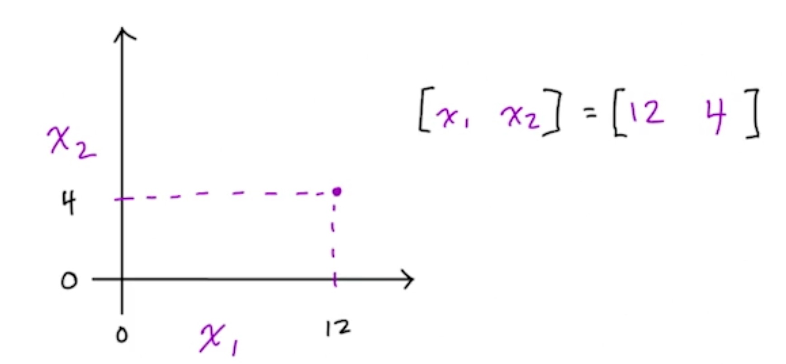
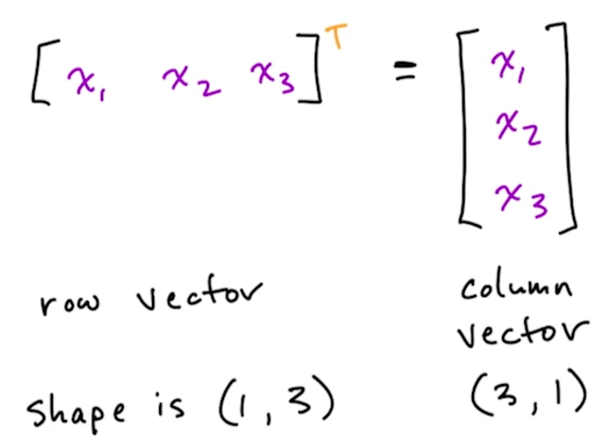
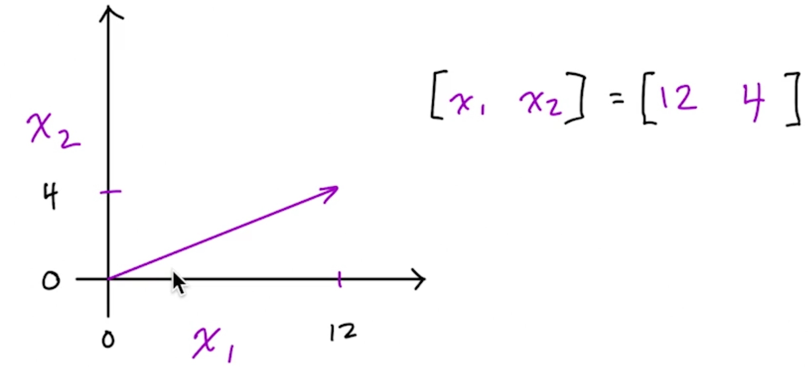
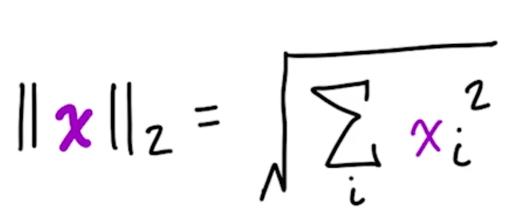
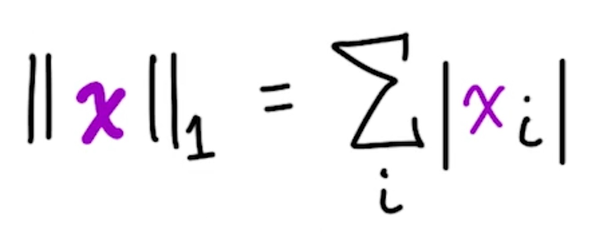
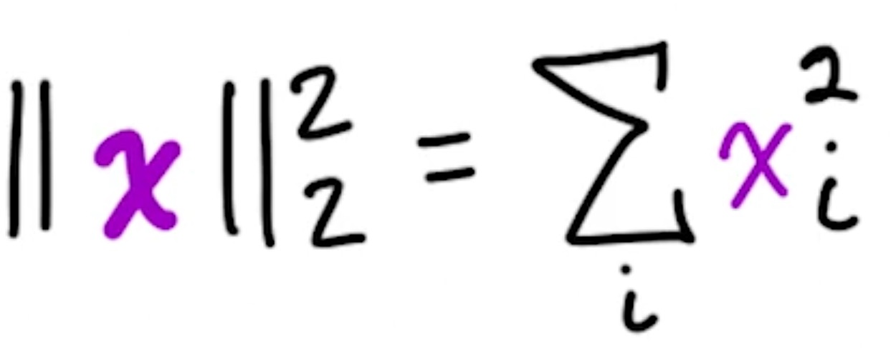
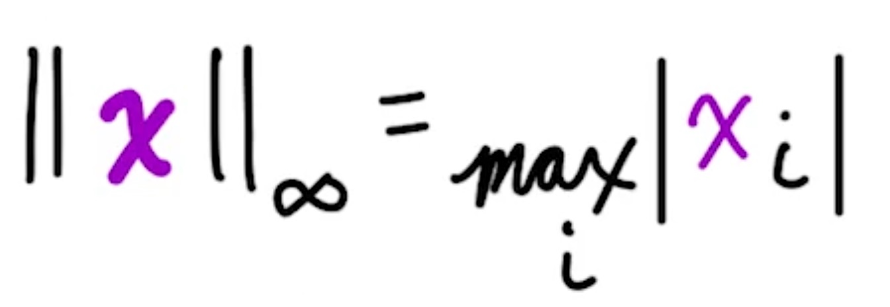
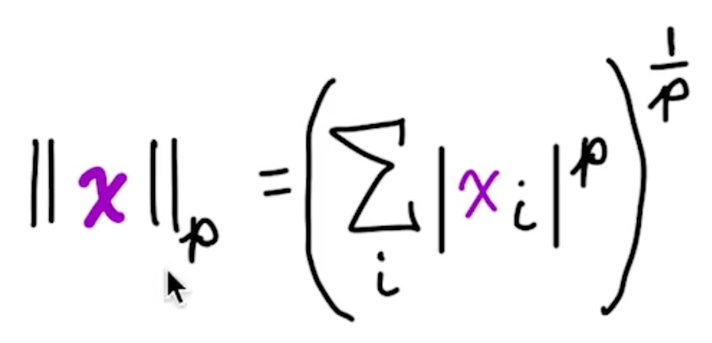
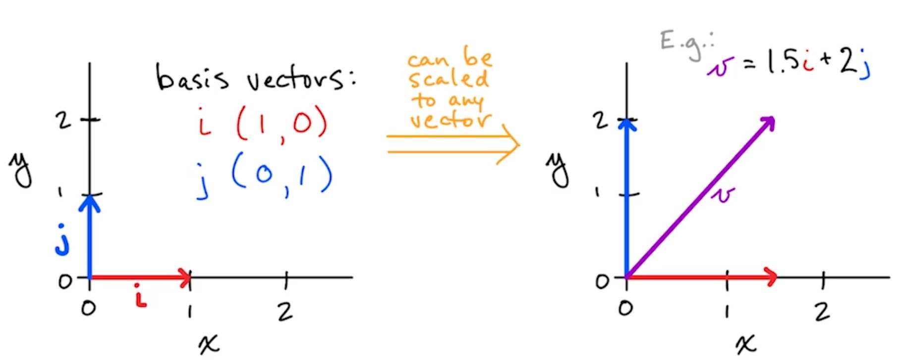
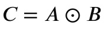

# Linear Algebra

Algebra is arithmetic that includes non-numerical entities like x.

```text
2x + 5 = 25
```

If equation has no exponential term, it is Linear algebra.

If it has an exponential term, it isn't linear algebra, e.g.:

> 2 x<sup>2</sup> + 5 = 25

***Linear Algebra is solving for unkowns within system of Linear equations.***

> **Note**  
> In linear algebra, as lines will be always straight, so there will be options:
>
> * No Solution (Lines are parallel.)
> * Exactly one solution (Lines intercept at one point)
> * Many solutions (Lines are exactly on top of eachother.)

---

## Tensors

Tensor is ML generalization of vectors and matrices to any number of dimensions.  

A tensor is a structured collection of values arranged in 0D, 1D, 2D, or higher dimensions, used to represent data in machine learning.
They are the core data structure in frameworks like TensorFlow and PyTorch.


---

## Scalars

* No dimensions
* Single number
* Denoted in lowercase, italics, e.g.: *x*
* Should be typed, like all other tensors: e.g., int, float32

---

## Vectors

* One-dimensional array of numbers
* Denoted in lowercase, italics, bold, e.g.: ***x***
  * Arranged in an order, so element can be accessed by its index
  * Elements are scalars so not bold, e.g., second element of x is x2
* Representing a point in space:
  * Vector of length two, represents location in 2D matrix (shown below)
  * Length of three represents location in 3D cube
  * Length of n represents location in n-dimensional tensor



---

## Vector Transposition



---

## Zero Vectors

Have no effect if added to another vector.

```text
[0., 0., 0.]
```

---

## Norms

* Vectors represent a magnitude and direction from origin.

* **Norms** are functions that quantify vector magnitude.

> Note:- Magnitude is length of a vector.



---

## L<sup>2</sup> Norm

* Measures simple (Euclidean) disyance from the origin.

* Most common norm in machine learning.
  * Instead of ||***x***||<sub>2</sub>, it can be denoted as ||***x***||



---

## Unit Vectors

* Special case of vector where its length is equal to one
* Technically, ***x*** is a unit vector with "unit norm", i.e.: ||***x***||<sub>2</sub> = 1


---

## L<sup>1</sup> Norm

* Another common norm in ML
* Varies linearly at all locations whether near or far from origin
* Used whenever difference between zero and non-zero is key



---

## Squared L<sup>2</sup> Norm

* Computationally cheaper to use than L<sup>2</sup> norm because:
  * Squared L<sup>2</sup> norm equals simply x<sup>T</sup>x.
  * Derivative (used to train many ML algorithms) of element x requires that element alone, whereas L<sup>2</sup> norm requires X vector.
* Downside is it grows slowly near origin so can't be used if distinguishing between zero and near-zero is important.



---

## Max Norm (or L<sup>∞</sup> Norm)

* Final norm we'll discuss; also occurs frequently in ML.
* Returns the absolute value of the largest-magnitude element.



---

## Generalized L<sup>p</sup> Norm

* p must be:
* Can derive L<sup>1</sup>, L<sup>2</sup>, and L<sup>∞</sup> norm formulae by substituting for p.
* Norms, particularly L<sup>1</sup> and L<sup>2</sup>, used to regularize objective functions



---

## Basis Vectors

* Can be scaled to represent any vector in given vector space.
* Typically use unit vectors along axis of vector space.



---

## Orthogonal Vectors

* x and y are orthogonal vectors if x<sup>T</sup>y = 0.
* Are at 90° angle to each other (assuming non-zero norms).
* n-dimensional space has max n mutually orthogonal vectors (again, assuming non-zero norms)
* Orthonormal vectors are orthogonal and all have unit norm.
  * Basis vectors are an example.


---

## Matrices

* Two-dimensional array of numbers.
* Denoted in uppercase, italics, bold, e.g.: ***X***
* Height given priority ahead of width in notation, i.e.: (n<sub>row</sub>, n<sub>col</sub>)
* If ***X*** has three rows and two columns, its shape is (3, 2).
* Individual scalar elements denoted in uppercase, italics only.
  * Element in top-right corner of matrix ***X*** above would be *X*<sub>1</sub>, <sub>2</sub>
* Colon represents an entire row or column:
  * Left column of matrix ***X*** is *X*<sub>:</sub>, <sub>1</sub>
  * Middle row of matrix ***X*** is *X*<sub>2</sub>, <sub>:</sub>


---

## Generic Tensor Notation

* Upper-case, bold, italics, sans serif, e.g., ***X***
* In a 4 tensor X, element at position (i, j, k, l) denoted as *X* <sub>(i, j, k, l)</sub>
* Rank 4 tensors are common for images.

---

## Tensor Transposition

* Transpose of scalar is itself, e.g.: x<sup>T</sup> = x
* Transpose of vector, seen earlier, converts column to row (and vice versa)
* Scalar and vector transposition are special cases of matrix transposition:
  * Flip of axes over main diagonal such that:  
  
    (***X***<sup>T</sup>)<sub>i, j</sub> = ***X***<sub>j, i</sub>


---

## Hadamard product Or element-wise product or Schur product

* A mathematical operation on two matrices of the same dimensions. It returns a new matrix of the same size, where each element is the product of the corresponding elements from the original matrices.
* For two matrices A and B of size m × n, their Hadamard product produces a matrix C of the same size.  



---

## The Dot Product

* If we have two vectors (say, x and y) with the same length n, we can calculate the dot product between them. This is annotated several different ways, including the following:
  * x . y
  * x<sup>T</sup> y

* Regardless which notation you use (I prefer the first), the calculation is the same; we calculate products in an element-wise fashion and then sum reductively across the products to a scalar value.
* The dot product is ubiquitous in deep learning: It is performed at every artificial neuron in a deep neural network, which may be made up of millions (or orders of magnitude more) of these neurons.

---

