# Calculus for Machine Learning

## Machine Learning House

---

## What Calculus Is

* Mathematical study of continuous change
* Two branches:
  * Differential calculus: focus of Calculus I
  * Integral calculus: a focus of Calculus II class

---

## What Differential Calculus Is

* Study of rates of change
* Consider a vehicle traveling some distance d over time t:

---

## Calculus of the Infinitesimals

* As integral accuracy improves as we approach an infinite-sided polygon, so too does differential accuracy improve as we approach a curve infinitely closely:

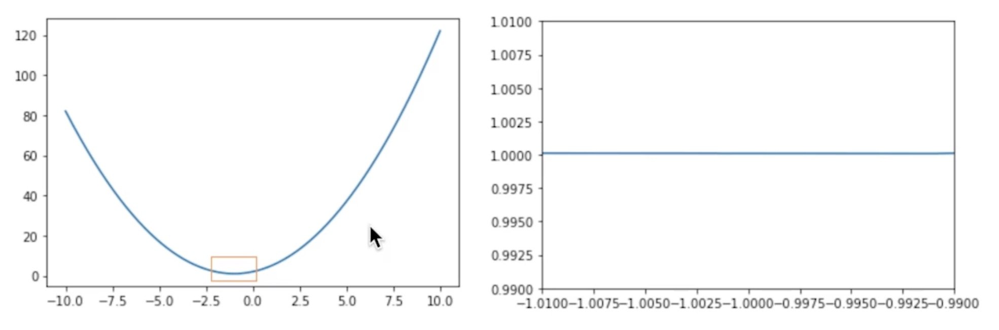

---

## Limits - Continuous function

* Trivially easy to calculate for a continuous function, e.g.:
  * What is the limit as x approaches 5 in the expression 2x2 + 2x + 2 ?

 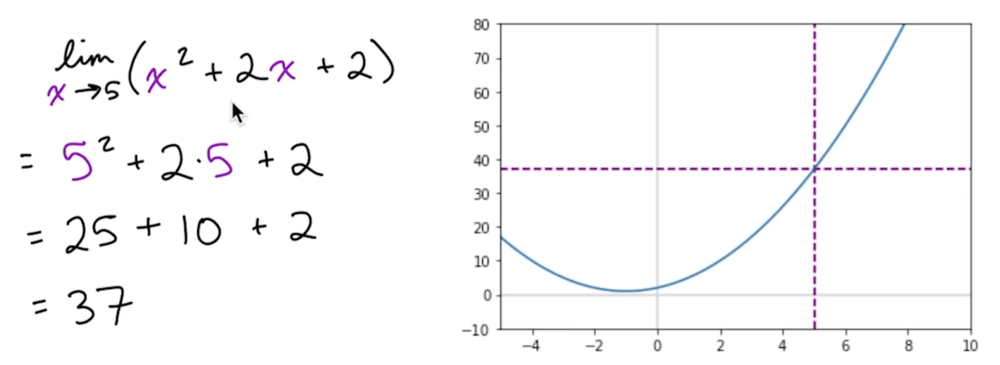

---

## Limits - DisContinuous function

* Some functions are not contineous
* In below function, we can't calculate y, if x = 1.
* It means. line breaks when x = 1. That makes it DisContinuous function.

 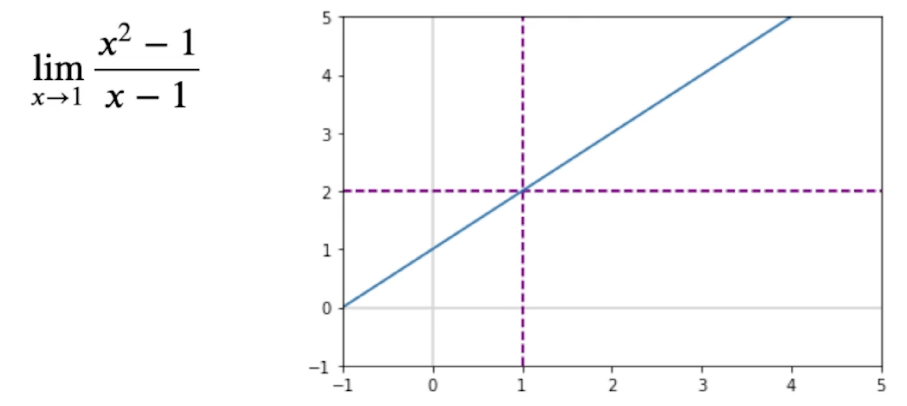

---

## Limits - Refactoring

* In some cases, we can solve the limit through algebra, e.g., factoring.

 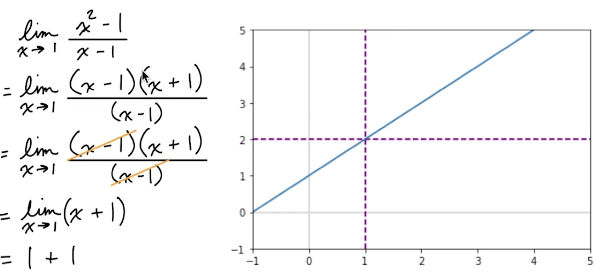

---

## Limits - Refactoring Not an option

* In other cases, we can't use algebra, but approaching the limit still works:

 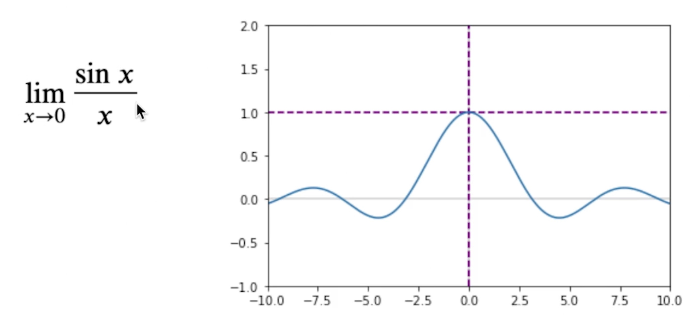

---

## Derivative

* A derivative is the instantaneous rate of change of a function. 

* It tells you exactly how fast something is changing at one precise moment, rather than over a period of time.

* Geometrically, if you look at a graph, the derivative represents the exact slope of the tangent line touching the curve at a single point.

---

## Delta Method (or differentiation from first principles)

* Delta Method is the foundational calculus technique used to find a function's derivative. 
* It calculates the exact slope of a curve at any point by finding the limit of the average rate of change as **the change in x approaches zero.**

* Δx --> 0 : You read this as change in x approaches zero.

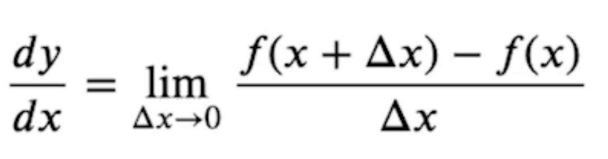

---

## Slope

* Slope is a measure of the steepness and direction of a line. 

* It quantifies how much a vertical value changes compared to a horizontal value.

* In simple terms, slope tells you how steep a hill is and whether it goes up or down.

### Core Meanings of Slope

* **Rise Over Run:** The ratio of vertical change to horizontal change between any two points on a line.

* **Rate of Change:** How fast the dependent variable (y) changes for every single unit increase in the independent variable (x).

### Direction Indicator

* **Positive slope:** The line climbs from left to right.

* **Negative slope:** The line falls from left to right.

* **Zero slope:** The line is perfectly flat and horizontal.

* **Undefined slope:** The line is perfectly straight up and down (vertical).

### Formula

* The formula for the slope of a straight line passing through two points (x 1, y 1) and (x 2, y 2) is **"rise over run."**

* Mathematically, it is written as:

  $m = \frac{y_2 - y_1}{x_2 - x_1}$

* Key Terms ($m$): 
  * The standard symbol used for slope.
  * $(y_2 - y_1)$: The vertical change (rise).
  * $(x_2 - x_1)$: The horizontal change (run).

---

## Derivative of a Constant

* Assuming c is constant:
  * $m = \frac{d}{dx}$ c = 0

* **Intuition:** A constant has no variatio, so it's slope is nothing/zero.
  * $m = \frac{d}{dx}$ 25 = 0

---

## Derivatives: Power Rule

* The Power Rule is a fast shortcut in calculus used to find the derivative of a variable raised to a exponent (a power). 

* It eliminates the need to use the long, multi-step delta method every time you want to find a slope.

#### The Formula 

* If your function is   
    $f(x) = x^n$,  
Where n is any real number, the derivative is:  

  $f^{\prime }(x)=n\cdot x^{n-1}$

  Or

  $\frac{d}{dx} x^n = n\cdot x^{n-1}$

#### The Two-Step Rule

To apply the formula, follow these two quick steps:

1. Bring the power to the front (multiply the variable by the original exponent n).
2. Subtract 1 from the power (the new exponent becomes n-1).

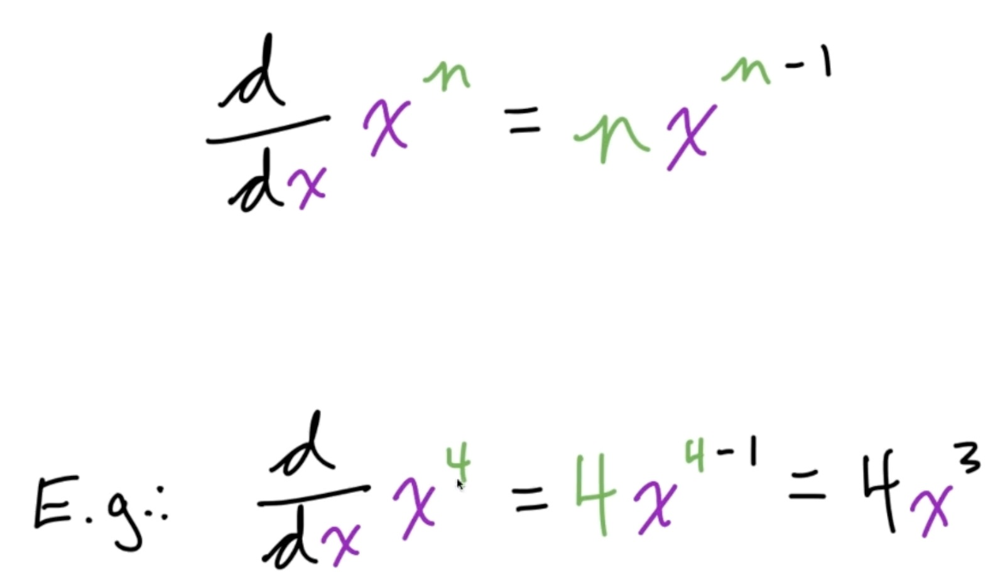

---

## Constant Product/Multiple/Multiplication Rule

* The derivative of a constant multiplied by a function is equal to the constant multiplied by the derivative of that function

* Essentially, a constant attached to a variable behaves like a "passenger"; it sits outside the differentiation process untouched, and then multiplies the final result at the very end.

#### The Formula

$\frac{d}{dx} [c\cdot f(x) ] = c\cdot \frac{d}{dx} [f(x)]$

OR

$\frac{d}{dx} (c\cdot y) = c\cdot \frac{d}{dx} (y) = c\cdot \frac{dy}{dx}$

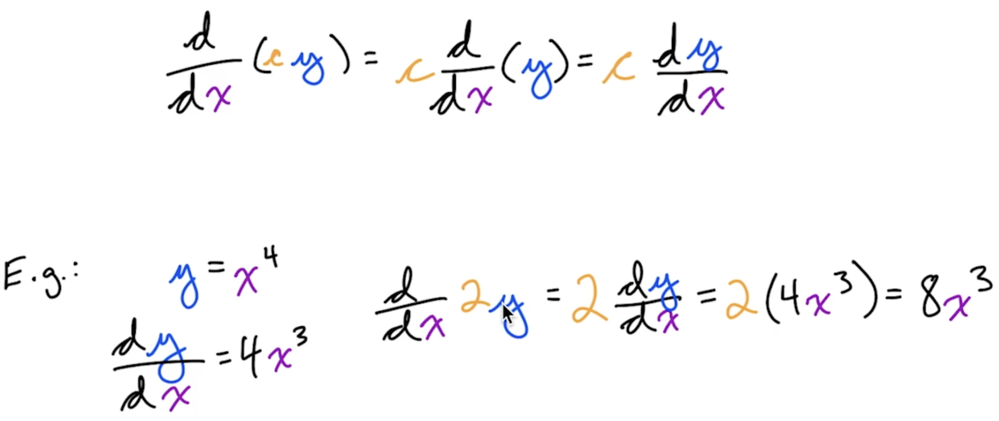

---

## Sum Rule

* The Sum Rule in calculus states that the derivative of a sum of two or more functions is simply the sum of their individual derivatives.

* In plain terms, when you have a long polynomial expression with terms separated by plus signs, you do not need to do anything fancy. 

* You just find the derivative of each part separately, one by one, and keep the plus signs between them.

* The rule works exactly the same way for subtraction, which is known as the Difference Rule.

#### The Formula

$\frac{d}{dx} [f(x) + g(x)] = f^{\prime} (x) + g^{\prime} (x)$

OR

$\frac{d (y + w)}{dx} = \frac{dy}{dx} +  \frac{dw}{dx}$

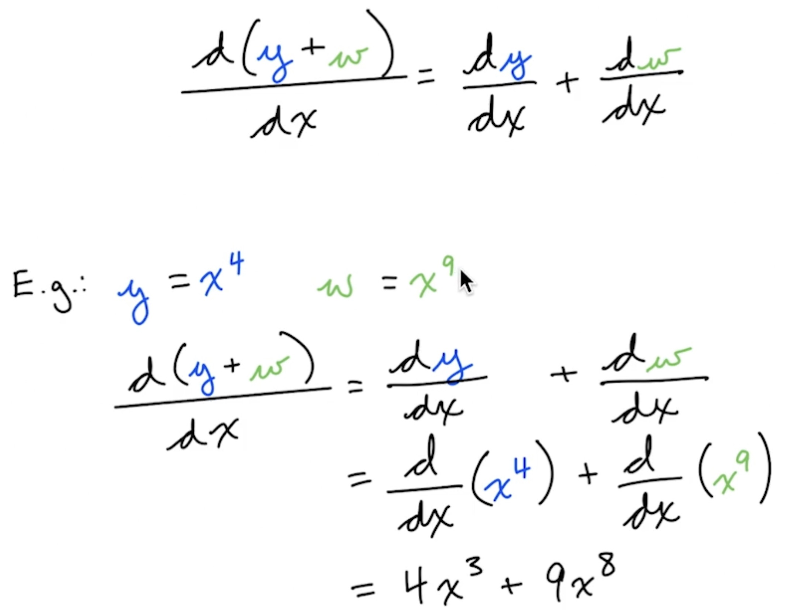

---

## Product Rule

* The Product Rule is the calculus formula used to find the derivative when two different functions are multiplied together.

* A common trap in calculus is assuming you can just multiply the individual derivatives together. That does not work. Because both parts of the function are changing at the same time, they affect each other's rates of growth.

#### The Formula

$\frac{d}{dx} [f(y) \cdot f(w)] = f^{\prime }(x) \cdot f(w) +  f(x) \cdot f^{\prime }(w)$

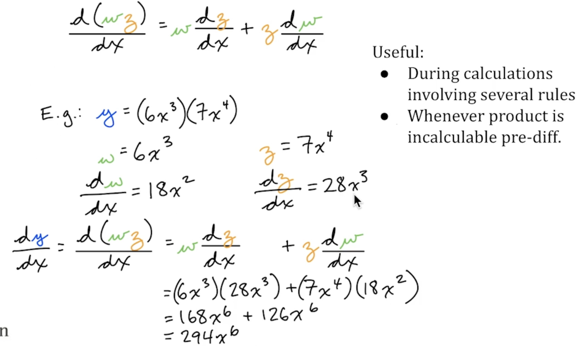

---

## Quotient Rule / Fraction Rule

* The Quotient Rule is the calculus shortcut used to find the derivative when one function is divided by another function (a fraction).

* Just like multiplication, you cannot simply divide the derivative of the top by the derivative of the bottom. Because both the numerator and the denominator are changing at the same time, you must use a specific formula to balance their rates of change.

#### The Formula

* If your function is a fraction, $\frac{f(x)}{g(x)}$, the derivative is:

  $\frac{d}{dx} [\frac{f(x)}{g(x)}] = \frac{f^{\prime }(x) \cdot g(x) -  f(x) \cdot g^{\prime }(x)}{[g(x)]^{2}}$

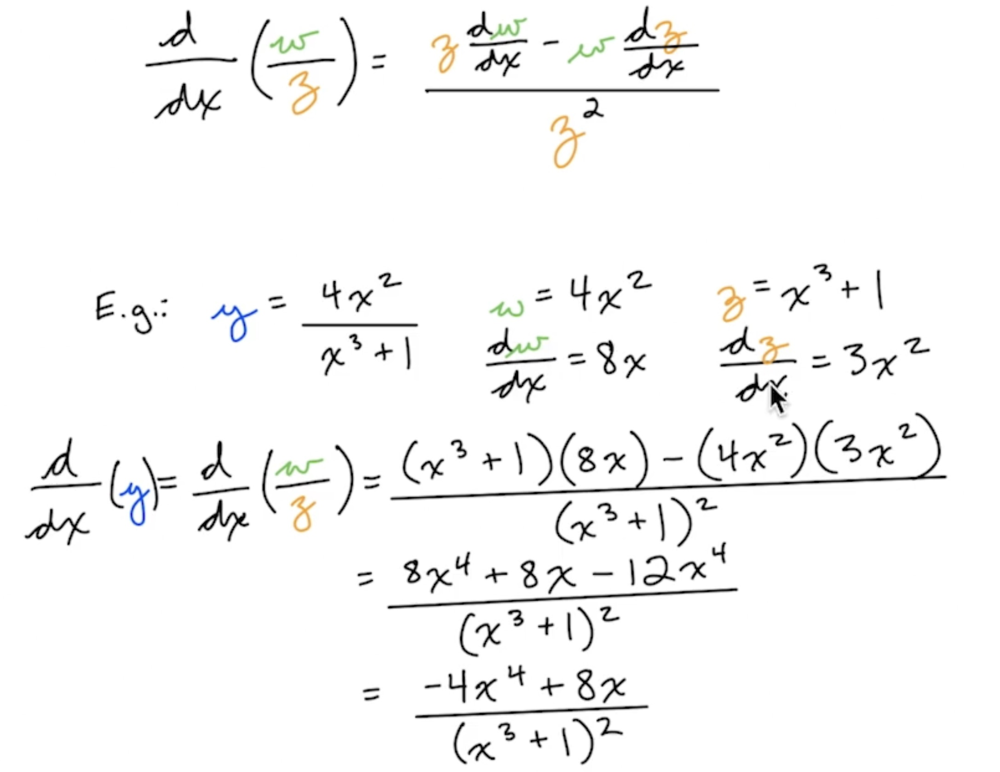

---

## Chain Rule

* The Chain Rule is the calculus formula used to find the derivative of a composite function. A composite function is a "function inside a function"—like a set of nesting Russian dolls.

* You need the Chain Rule whenever an algebraic operation is wrapped inside another operation

### The Formula

* If your function is $y = f(g(x))$, where f is the outer function and g is the inner function, the derivative is:

  $\frac{dy}{dx} = f^{\prime }(g(x)) \cdot g^{\prime }(x)$

* In plain words, the process follows a strict two-step routine:
  1. Differentiate the outside layer, leaving the inside layer completely alone.
  2. Multiply by the derivative of the inside layer. 

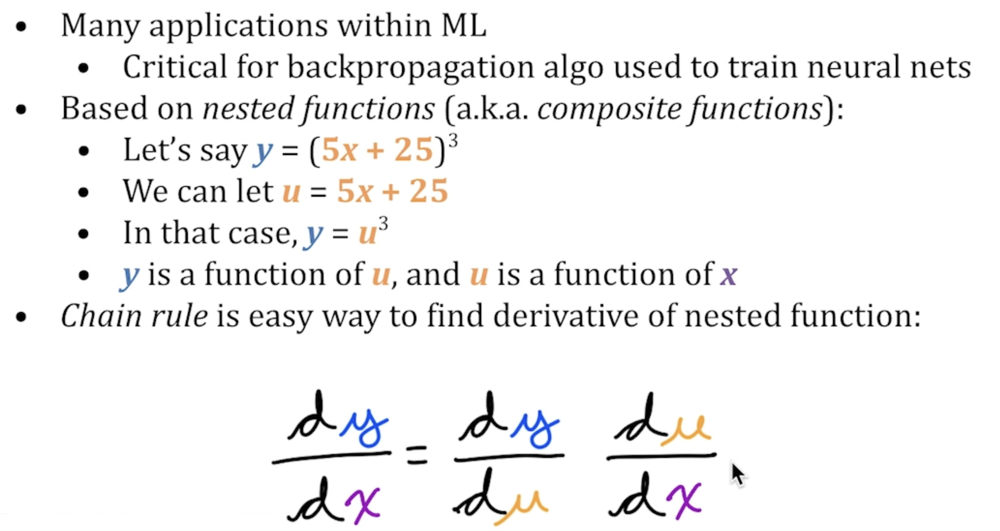

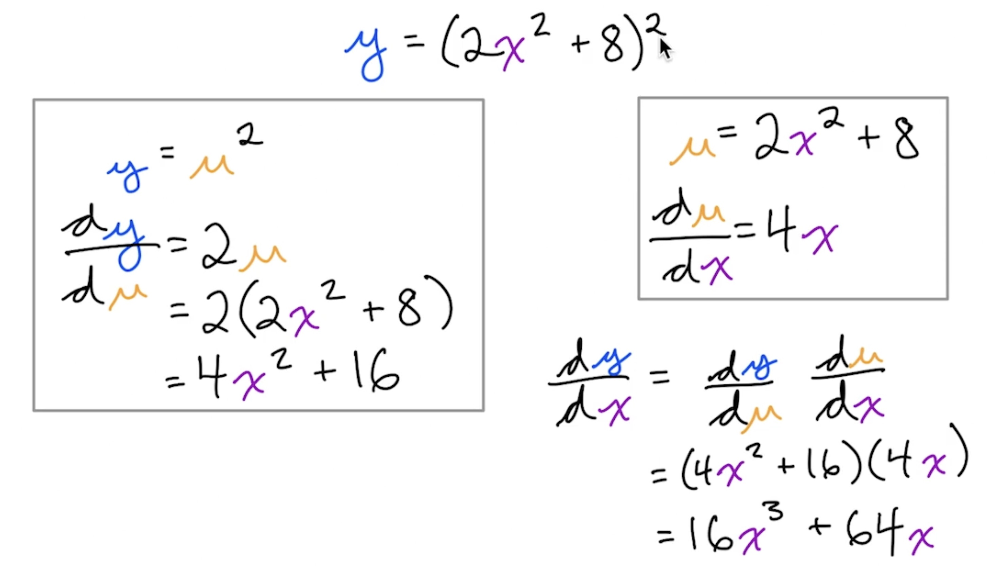

---

## Power Rule on a Function Chain

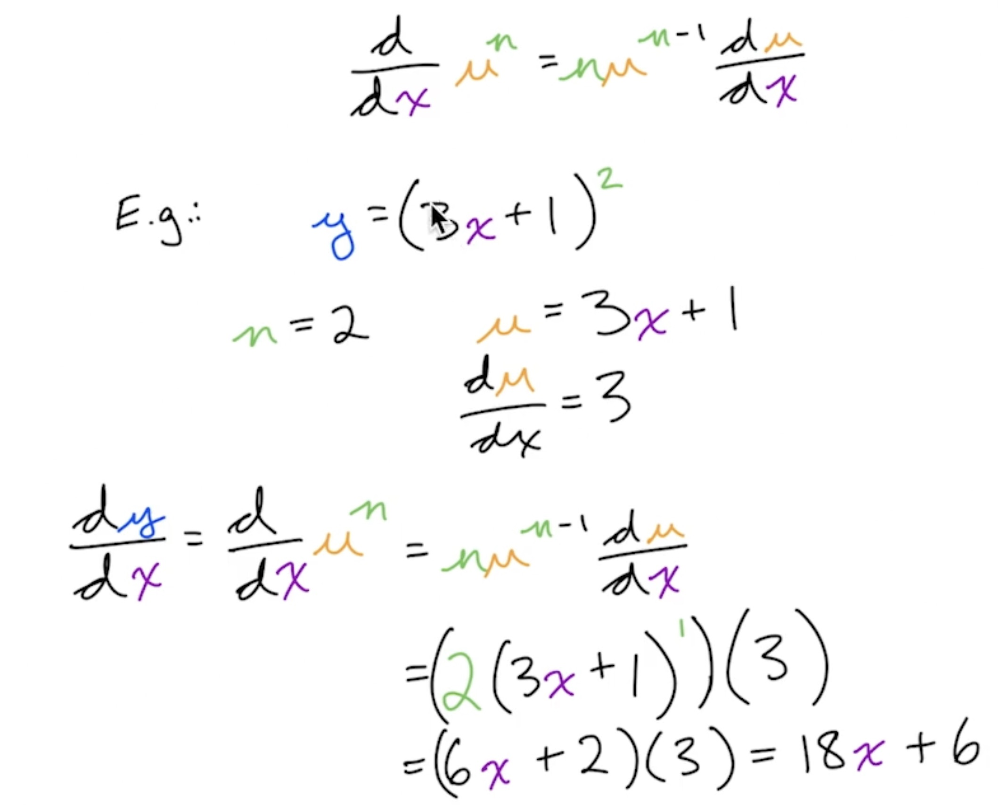

---

## Automatic Differentiation

* A.K.A.: autodiff or autograd
  * Computational diff.
  * Reverse mode diff.
  * Algorithmic diff.
* Distinct from classical methods:
  * Numerical diff. (delta method; introduces rounding errors)
  * Symbolic diff. (algebraic rules; computationally inefficient)
* Relative to classical methods, better handles:
  * Functions with many inputs (common in ML)
  * Higher-order derivatives