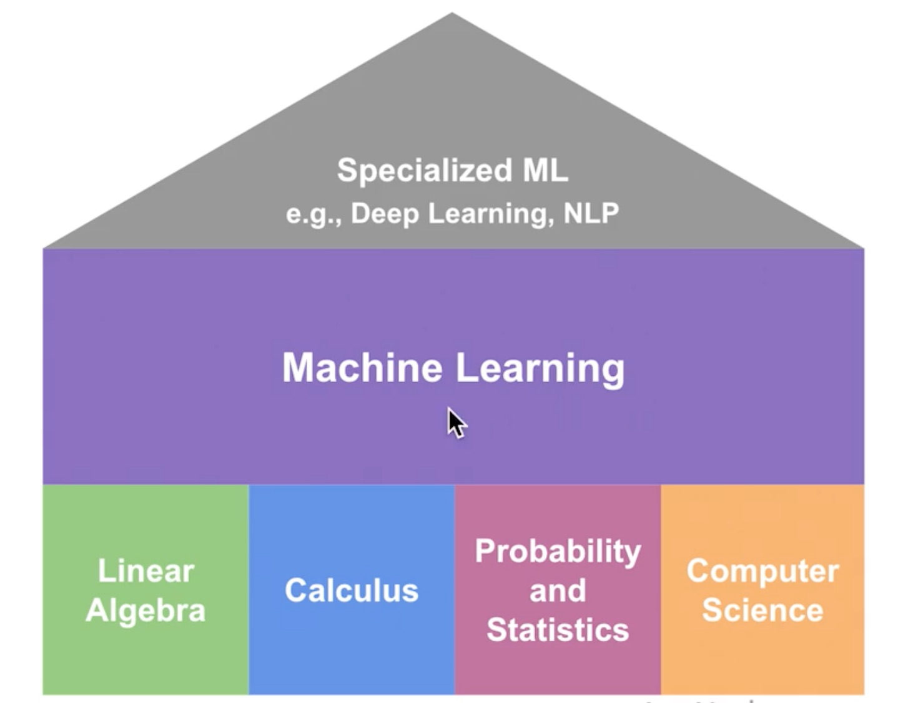
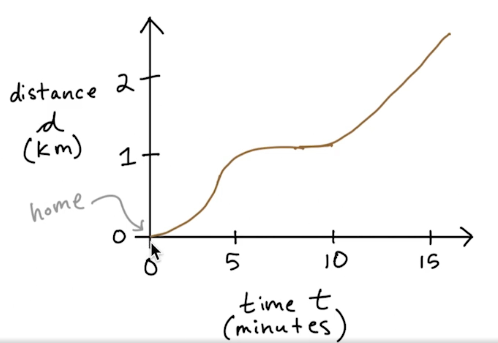
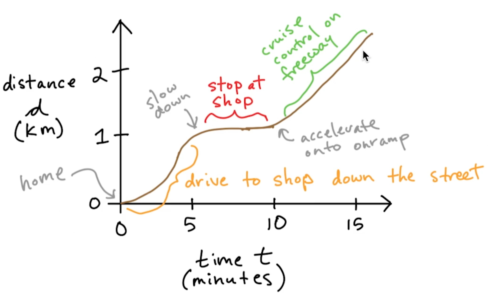

# Calculus for Machine Learning

## Machine Learning House

---

## What Calculus Is

* Mathematical study of continuous change
* Two branches:
  * Differential calculus: focus of Calculus I
  * Integral calculus: a focus of Calculus II class

---

## What Differential Calculus Is

* Study of rates of change
* Consider a vehicle traveling some distance d over time t:

