 #Deep Learning Artificial Neural Networks

---

## What is Machine Learning

* The dumb-as-possible approach:

  ### 
**Machine learning is nothing but a Geometry Problem**

* Below is all what Mchine Learning is:  

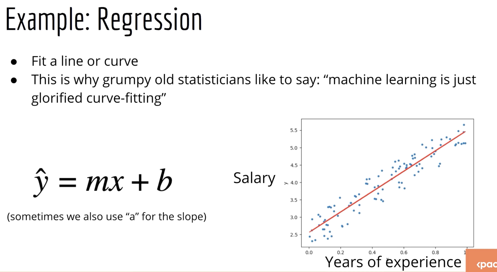

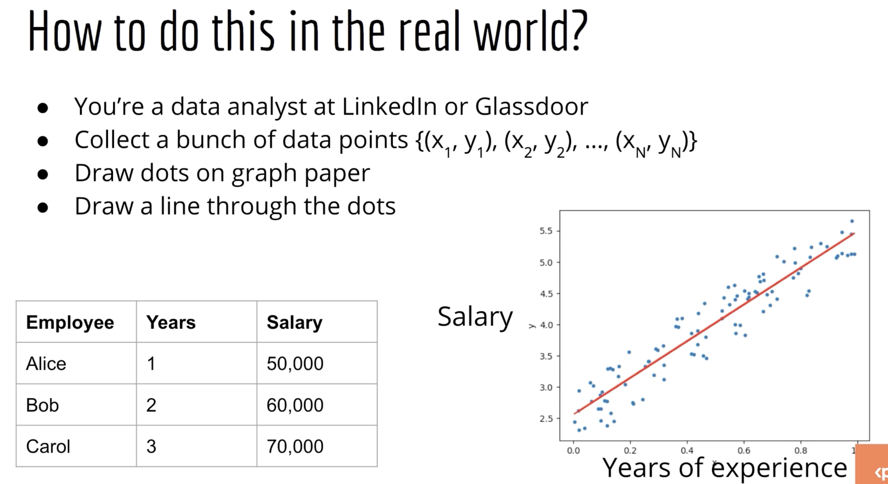

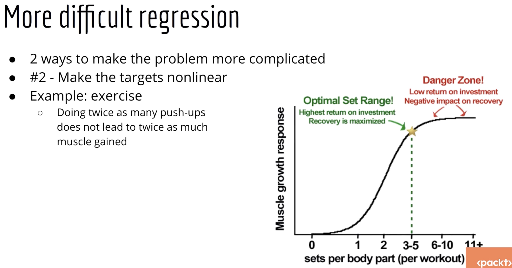

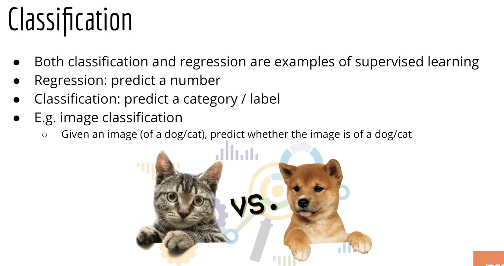

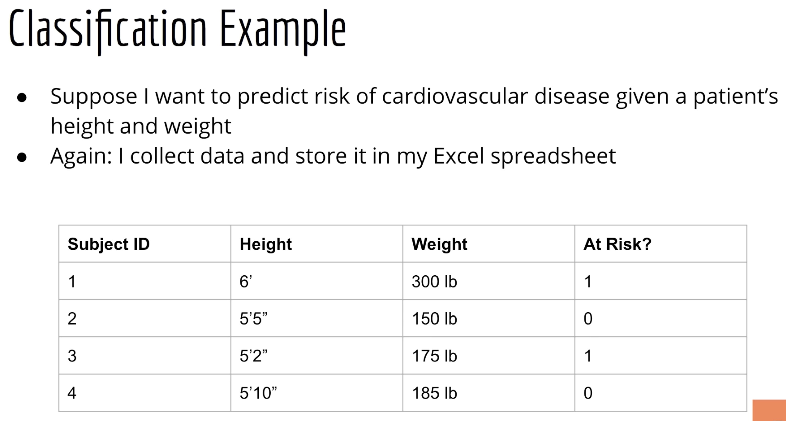

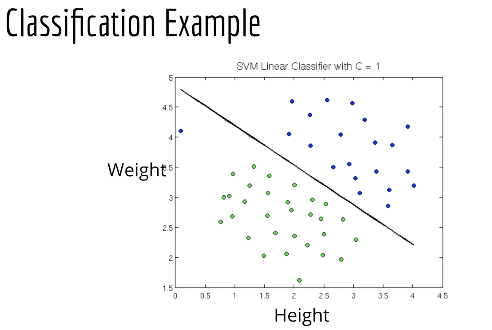

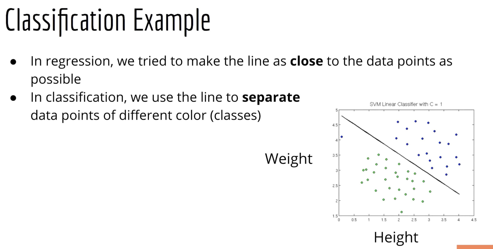

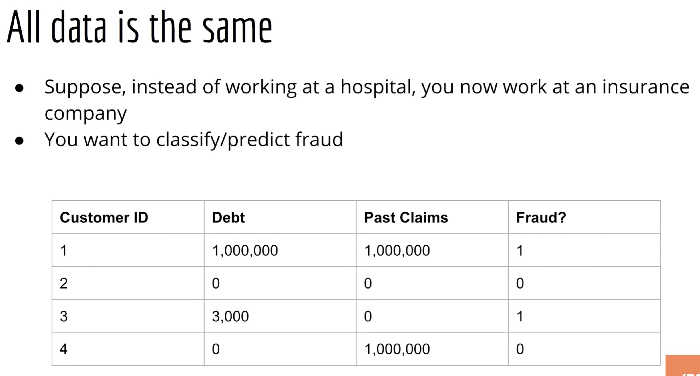

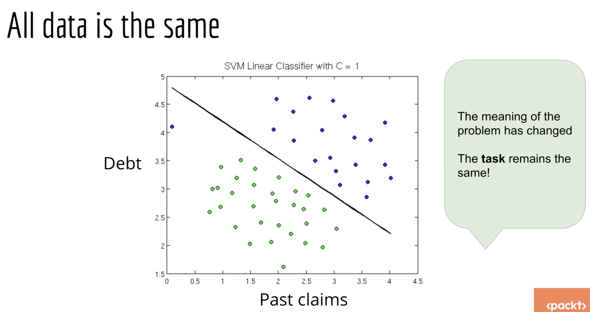

**More complicated Classification, but still a Geomaetry Problem.**

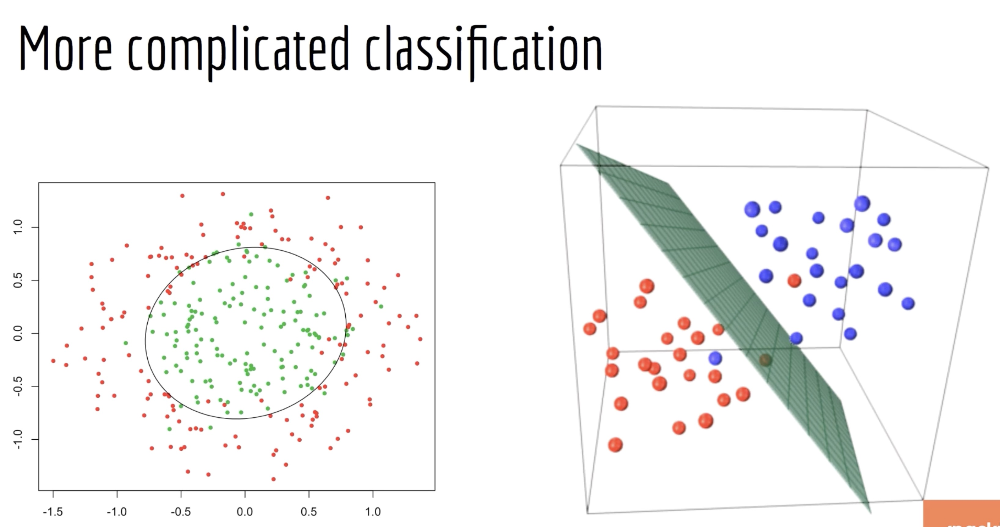

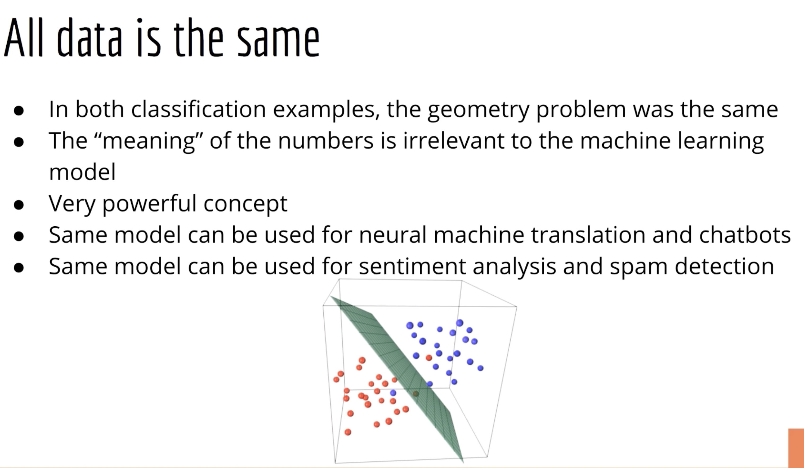

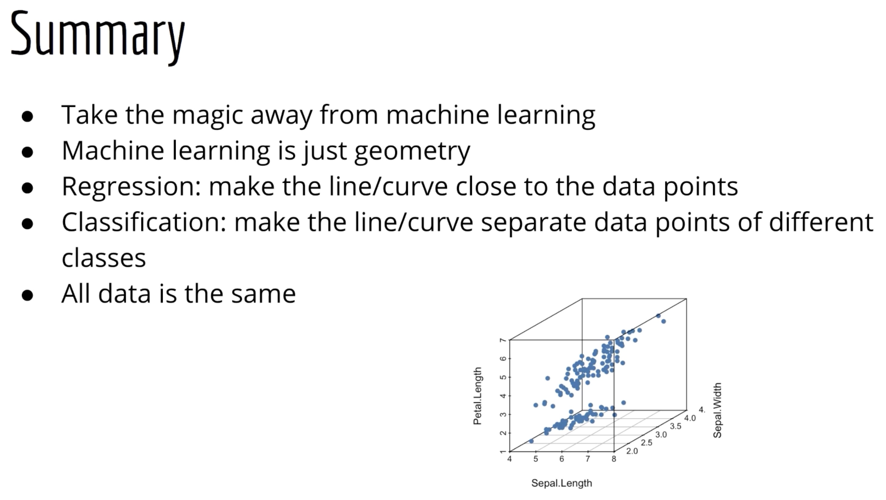

---

## Code Preparation (Classification Theory)

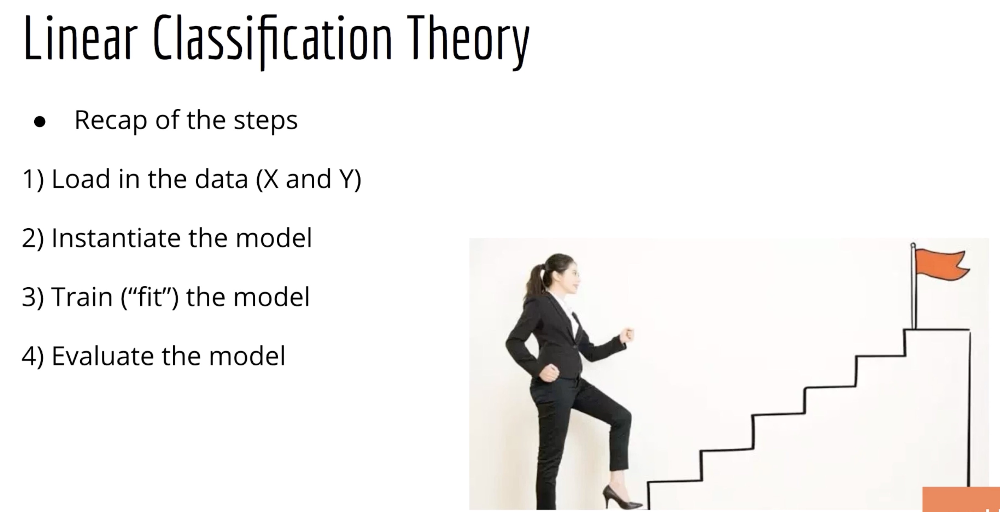

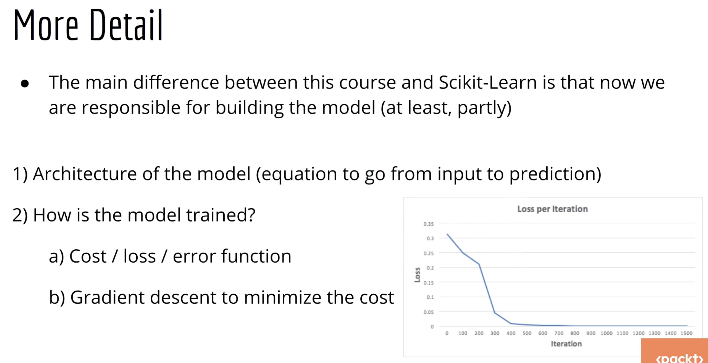

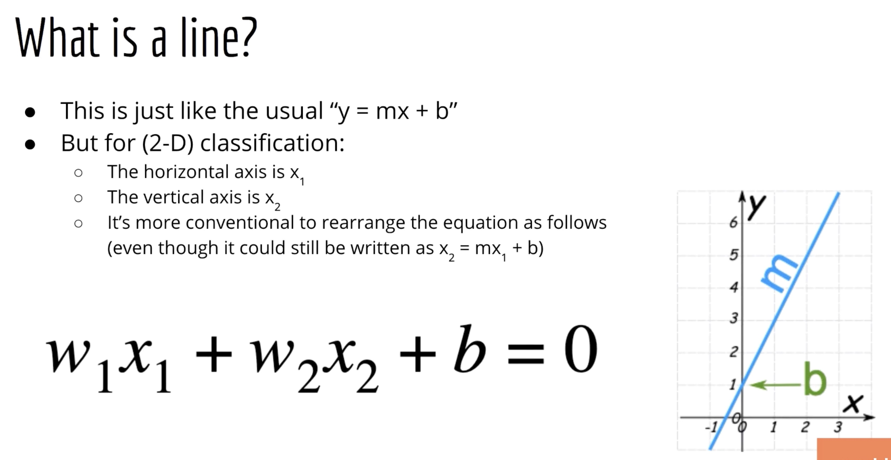

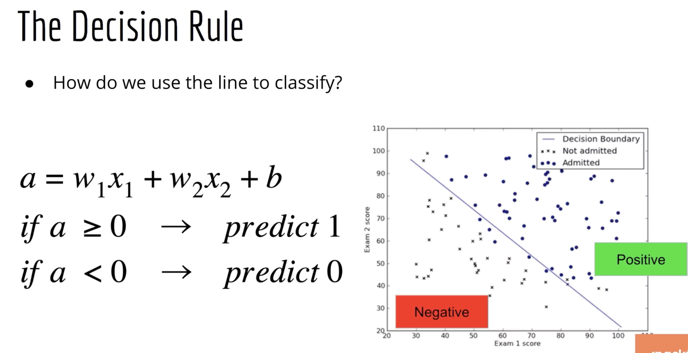

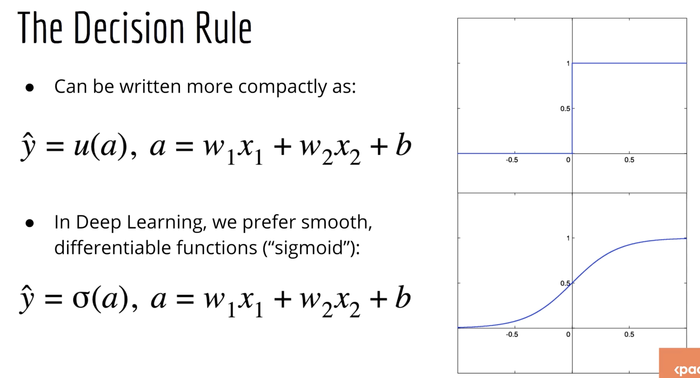

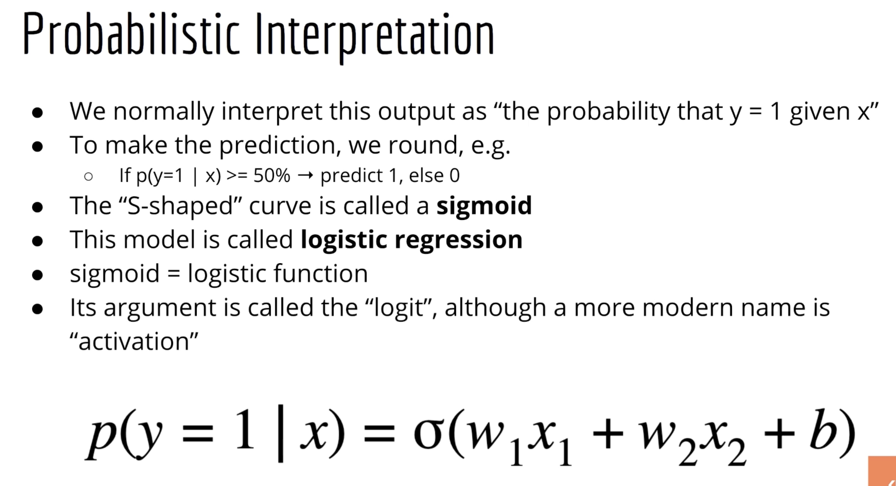

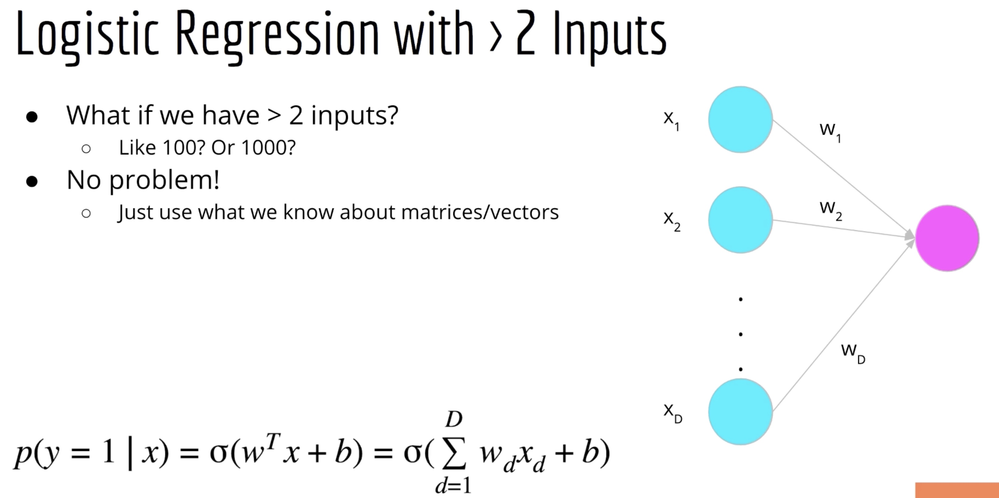