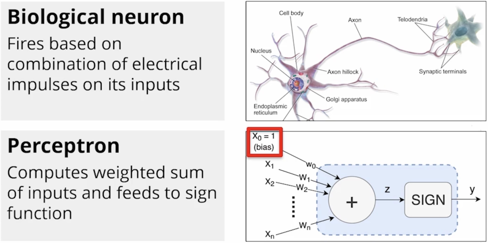
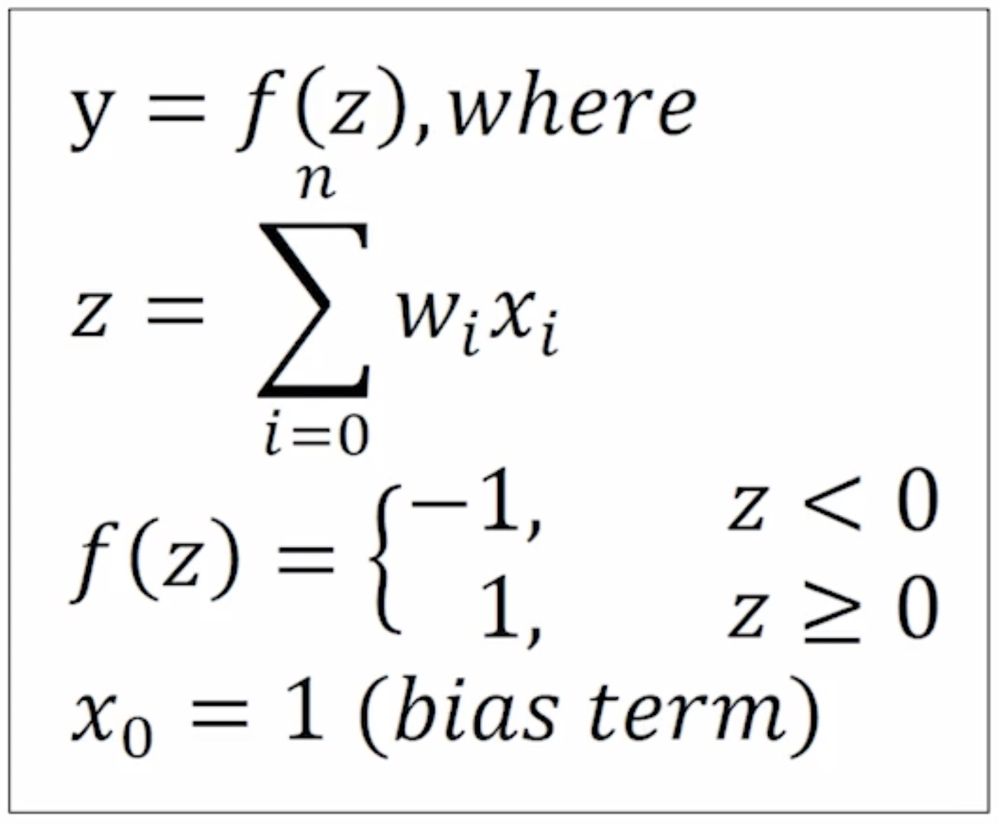

# Lesson 2: Neural Network Fundamentals I

---

## The Perceptron and Its Learning Algorithm

### Biological Neuron and the Perceptron

* The perceptron is a supervised learning algorithm designed to mimic biological structure. 

* It serves as the basic unit of an artificial neural network and is used primarily for binary classification (sorting data into one of two categories, like "yes" or "no").

### Mathematical Description of Perceptron

