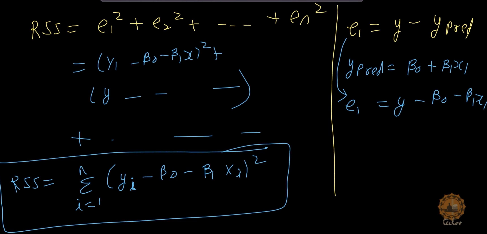
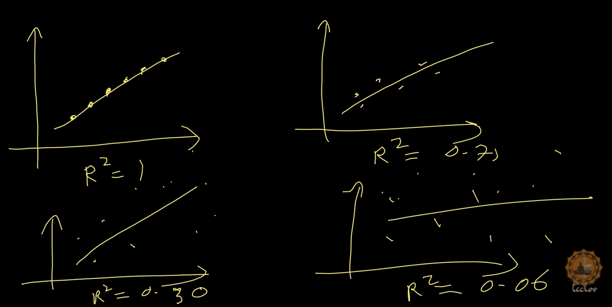

# Chapter.1 Simple Linear Regression

---

## Types of Machine Learning

1. Regression 
  * Assigns a Label

2. Classification
  * Assigns a Label

3. Clustering
  * Assigns no Label
---

## Supervised Learning
  * In supervised learning, we are going to have some label.
  
  * Based on label, we will do some predictions.

  * Below ML types fall under supervised learning
    * Regression 
    * Classification

---

## Unsupervised Learning
  * In unsupervised learning, we don't assign labels.

  * We bring alike objects together

  * Below ML type fall under supervised learning
    * Clustering

---

## Equation of Line

* $y = mx + b$

* $m$ is slope
* $b$ is intercept
* $y$ is y-prediction Or $\^{y}$

* The line equation can be wrritten as:
  
  * $\^{y} = \beta_0 + \beta_1 x $

  * This is read as Beta Not and Beta One. 

  * $m$ is slope

  * $\beta_0$ is intercept
  * $\beta_1$ is slope
  * $\^{y}$ is y-prediction

---

## Residual Sum of Squares (RSS)

* The Residual Sum of Squares (RSS) is a statistical metric used in Machine Learning to measure the total variance or discrepancy between the actual data points and the values predicted by a regression model (such as a linear regression). 

* It quantifies the amount of error remaining in your model after fitting it to the training data, where a lower RSS value indicates a better fit to the dataset.

    $ RSS =  \sum _{i=1}^{n}(y_{i} - \^{y}_{i})^{2} $

* Where:
  * $n$ is the total number of data points (observations).

  * $y_{i}$ represents the actual observed value of the target variable for the $i-th$ data point.

  * $\^{y}_{i}$ represents the predicted value generated by the model for the $i-th$ data point.

  * $(y_i - \^{y}_i)$ is the individual error, known as the **residual**.

---

## Total Sum of Squares (TSS)

* It is a fundamental statistical metric used to measure the total variation or dispersion of your target variable in a dataset.

* In regression tasks (where you predict a continuous number, like house prices), your goal is to build a model that explains as much of the data's variation as possible. 

* TSS represents the baseline "total error" if you only used the average of the target variable as your prediction, without any machine learning model.

#### How is TSS Calculated?

* To find the TSS, you take each actual data point, subtract the average (mean) of all data points, square the result, and add them all together.

* The mathematical formula is:

    $TSS = \sum_{i=1}^{n} (y_i - \bar{y})^2$

* Where:
  * $n$ = the total number of data points

  * $y_i$ = the actual value of a specific data point

  * $\bar{y}$ = the mean (average) of all the actual values

---

## Coefficient of determination

* The coefficient of determination, commonly denoted as $R^{2}$ or $r^{2}$, is a statistical metric that measures how well a model explains and predicts future outcomes. 

* It represents the proportion of the variance in the dependent variable that is predictable from the independent variable(s).

* Formula:

    $R^2 = 1 - \frac{RSS}{TSS}$

* Where $RSS$ is the residual sum of squares (unexplained variance) and $TSS$ is the total sum of squares (total variance).

#### $R^2$ Values

* Ranges from $0$ to  $1$ (or 0% to 100%). 

* A value of $1$ means the model perfectly predicts the outcomes.

* While a value of $0$ indicates the model performs no better than simply guessing the average

---

