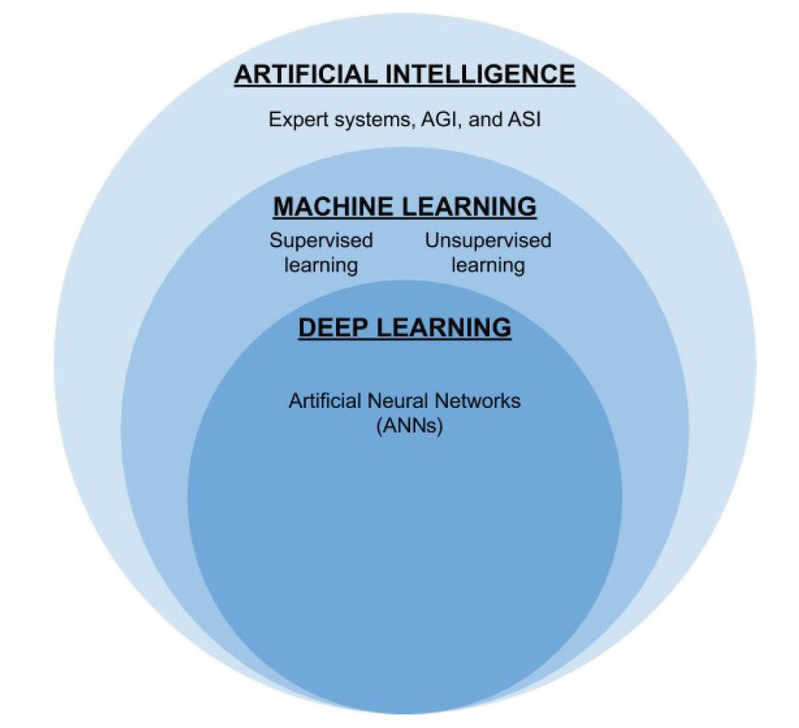

# Chapter 1: IntelliVerse: Navigating the AI Ecosystem
---

## Weak AI

Weak AI functions are based on a pre-existing combination of logic
and data.  

User inputs are processed based on the same logic, and hence, weak AI lacks self-consciousness and aggressive learning abilities.  

Some prominent examples of weak AI implementations are voice assistants, chatbots, and linguistic expert systems.  

Due to the narrow implementation of logic, weak AI is suitable for scenarios where the user’s inputs and expected outputs are well defined.

---

## Strong AI

Strong AIs are capable of perception, being conscious of the given problems and aided by its cognitive abilities. Strong AI has been one of the more prominent fields of research due to its potential ability in cutting down operational costs in existing processes, as well as exploring applications in uncharted territories.  

Expert systems, machine learning, and deep learning techniques are some of the most renowned manifestations of strong AI. These manifestations are commonly used by businesses due to their ability to predict and reason based on given data points.

Some other examples of strong AI applied across various industries include 
* Computer Vision (CV), 
* Natural Language Processing (NLP), 
* Natural Language Understanding (NLU), and 
* Reinforcement Learning (RL).  

For example, NLP can be used to adapt a system according to the user’s mood and help the system to communicate with the user more effectively compared to weak AI implementations.   

Similarly, strong AI can also be applied for efficient language translation with greater accuracy in the conversion between languages.

---

## Super AI

Super AI, or Artificial Super Intelligence (ASI), is the hypothetical ability of a computer to surpass the consciousness of the human mind.

Super AI, or Artificial Super Intelligence (ASI), is the hypothetical ability of a computer to surpass the consciousness of the human mind.  

It is speculated by many experts that an AI may achieve this stage after reaching the singularity.  

It is also widely believed that super AI would ultimately lead to the technological dominance of computers over human thinking. Although super AIs are nonexistent,

---

## Forms of AI and approaches

---

