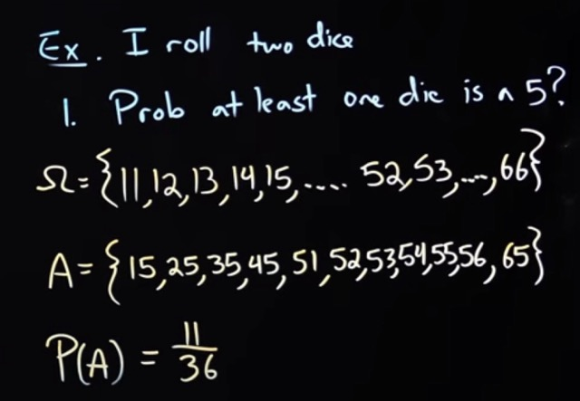

# Probability By Steve Brunton

(https://www.youtube.com/watch?v=4T3aOIfNdTY&list=PLMrJAkhIeNNR3sNYvfgiKgcStwuPSts9V&index=2)
---

## Introduction

The real world is complex. It's uncertain in terms of measure every thing. 

If something is too complex to Model and Measure, then it is a very good candidate for buiding a probability model of.

---

## Probability and Statistics

- **Probability** predicts what might happen.

- **Statistics** analyzes what did happen.

- They are two sides of the same coin.

- **Probability** is forward‑looking.

- **Statistics** is backward‑looking.

- **Probability** → starts with a model, predicts data.

- **Statistics** → starts with data, infers the model.

- This relationship is fundamental:

    - Probability is the math.
    
    - Statistics is the application of that math to real data.

| Concept      | What it is                         | Direction      | Example                                      |
|:--------------:|:-------------------------------------:|:----------------:|:----------------------------------------------:|
| Probability  | Math of uncertainty                 | Predictive     | Chance of rain tomorrow                      |
| Statistics   | Analysis of observed data           | Descriptive    | Average rainfall last year                   |
| Relationship | Probability predicts; statistics infers | Two-way bridge | ML uses both                                 |

---

## Probability of an event **A**

The probability of event $A$, written as $P(A)$, is a number between $0$ and $1$ that measures how likely event $A$ is to happen.

- $P(A) = 0 → A$ is impossible

- $P(A) = 1 → A$ is certain

- $0 < P(A) < 1 → A$ has some chance of occurring

$𝑃( 𝐴 ) = \frac{Number\ of\ ways\ A\ can\ happen}{Total\ Number\ of\ things\  that\ can\ happen}$

### Examples

**Coin flip -  getting heads**

- A = “heads”

- $𝑃 ( 𝐴 ) = \frac {1}{2}$

**Rolling a die -  getting 4**

- A = “rolling a 4 on a fair die”

- $𝑃 ( 𝐴 ) = \frac {1}{6}$

**Rolling a die -  getting an even number**

- A = {2, 4, 6}

- $𝑃 ( 𝐴 ) = \frac {3}{6}$

---

## Roll Two dice at a time and get atleast one die is a 5 - Manually

---

## Roll Two dice at a time and get at least one die is a 5 - Formula

**A = at least one die is a 5**

$P(A) = P(Dice1 = 5)  + P(Dice2 \neq 5) * P(Dice2 = 5)$

$P(A) = \frac {1}{6} + \frac {5}{6} * \frac {1}{6}$

$P(A) = \frac {1}{6} + \frac {5}{36}$

$P(A) = \frac {6}{36} + \frac {5}{36}$

$P(A) = \frac {11}{36}$

---

# How to count all the number of things that can happen

Probability is also called counting the number of things that can happen. 

It's also called study of combinators, the study of combinations.

Counting is a huge part of probability.

In fact, one entire branch of probability is built on counting:

- permutations

- combinations

- factorials

- sample spaces

- counting outcomes

---

## Example:- Number of possible outcomes for a sequence of 10 independent Coin flips - (Order Matters) (With Replacement)

|_2 outcomes_| |_2 outcomes_| |_2 outcomes_| ..... |_2 outcomes_|  
......(coin-1)........(coin-2)........(coin-3)..............(coin-10)

$Total\ Coins = 10$  

$Total\ Number\ of\ outcomes\ of\ each\ Coin = 2$ 

$Total\ number\ of\ outcomes\ of\ 10\ Coins = 2^{10}$

---

## Example:- Deck of 52 cards. How many 5 card runs can I deal off top of deck (Order Matters) (Without replacement)

| First Card | Second Card | Third Card | Fourth Card | Firth Card |
| :----:     | :----:   | :----:     | :----:     | :----:     |
| 1st card out of 52     | 2nd card out of 51     |  3rd card out of 50     | 4th card out of 49     | 5th card out of 48     |

$ = \frac {52!}{47!}$

---

## Factorials

$n! = n.(n-1).(n-2)......3.2.1$

---

## Come up with a formula with replacement (Order Matters)

$Number\ of\ choices = n$

$Sample\ r\ elements\ out\ of\ n\ choices.$  
$There\ are\ r\ indepenedent\ trials $

$Number of choices = n^r$

---

## Come up with a formula without replacement (Order Matters)

$Number of choices = \frac {n!}{(n-r)!}$

---

## Come up with a formula without replacement (Order doesn't Matters)

$Number of choices = \frac {n!}{(n-r)!. r!}$

---

## What probability measures

Probability measures the likelihood of some event A happening.

---

## What is a Sample Space $\Omega$

**The sample space $\Omega$ is the set of all possible outcomes of a random experiment.**

That's it.

Every probability problem starts by defining $\Omega$.

- If you flip a coin → list all possible outcomes

- If you roll a die → list all possible outcomes

- If you pick a card → list all possible outcomes

$\Omega$ contains everything that can happen, nothing more, nothing less.

---

## What little omega $\omega$ means

Little omega ($\omega$) is the symbol used for a single outcome(realization) inside the sample space $\Omega$.

$\omega$ is one specific result of a random experiment.

If $\Omega$ is the set of all possible outcomes, then $\omega$ is one of those outcomes(realizations).

If $\Omega$ is the sample space, then:

- $\omega \in \Omega$

Meaning:
- $\omega$ is an element of $\Omega$.

---

## Set Theory

### Set

A set is a collection of distinct objects.

### Subset

A set contained inside another set.

$𝐴 \subseteq B$

### Empty Set

A set with no elements.

$ \emptyset = \{\} $

### Universal Set

The “everything” set in a given context.

In probability, this is the sample space $\Omega$.

### Operations on Sets

#### Union $(A \cup B)$

Everything in A or B.

- $A \cup B$

#### Intersection $(A \cap B)$

Everything in A and B.

- $A \cap B$

#### Complement ($A^{\\c}$)

Everything not in A.

$A^{\\c} = \Omega - A$

#### Difference (A − B)

Elements in A but not in B.

### How Set Theory Connects to Probability

Probability is built on set theory.

#### Sample Space

- $\Omega = \{H, T\}$

#### Event

A subset of $\Omega$.

$𝐴 = { 𝐻 }$

#### Probability

Everything you do in probability is set operations.

A function that assigns numbers to sets:

- $𝑃 ( 𝐴 )$

#### Intersection → “A and B”

- $𝑃 ( 𝐴 \cap 𝐵 )$

#### Union → “A or B”

- $𝑃 ( 𝐴 \cup 𝐵 )$

#### Complement → “not A”

- $P(A^{\\c}) = 1 - P(A)$

---

## Sets and Probability 

Probability is a map from subset of $\Omega$ to Real Numbers ($\mathbb{R}$) and specifically to $[0, 1] \in \mathbb{R}$

---

## Properties of Probability

1. $P(\Omega) = 1$

2. If $A \in \Omega$, then $P(A) \geq 0$

3. If $A$ and $B$ are disjoint ($ A \cap B =  \emptyset$), then

- $P(A \cup B) = P(A) + P(B)$

4. $P(A^{\\c}) = 1 - P(A)$

5. $P(\emptyset) = 0$

6. If $𝐴 \subseteq B$ (A is subset of B), then
- $P(A) \leq P(B)$

7. If $A$ and $B$ are not disjoint ($ A \cap B \neq  \emptyset$), then

- $P(A \cup B) = P(A) + P(B) - P(A \cap B)$

---

## Birthday Problem

If there are n people in a room, how large does 'n' need to be for at least 50% chance of atleast 2 people sharing a birthday.

5/44