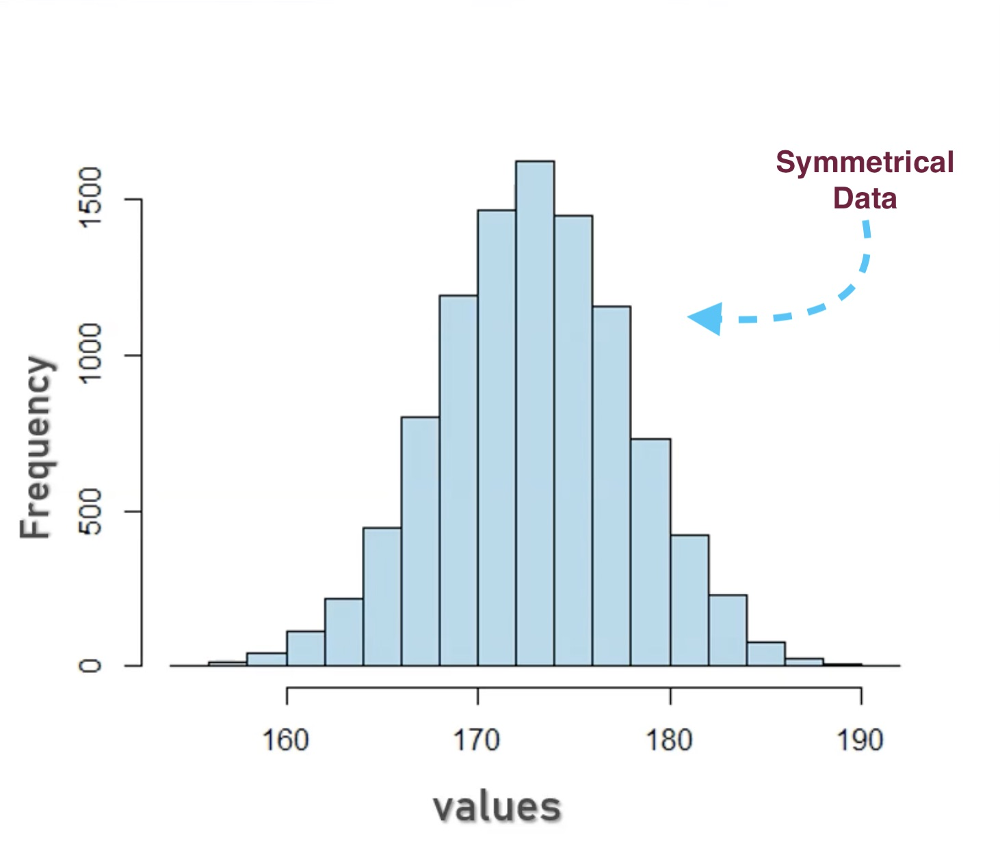
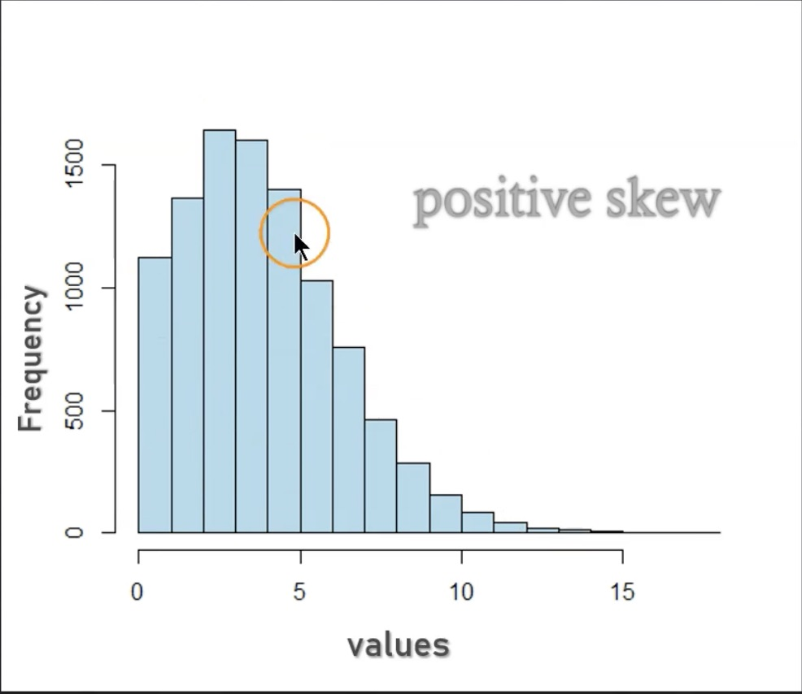
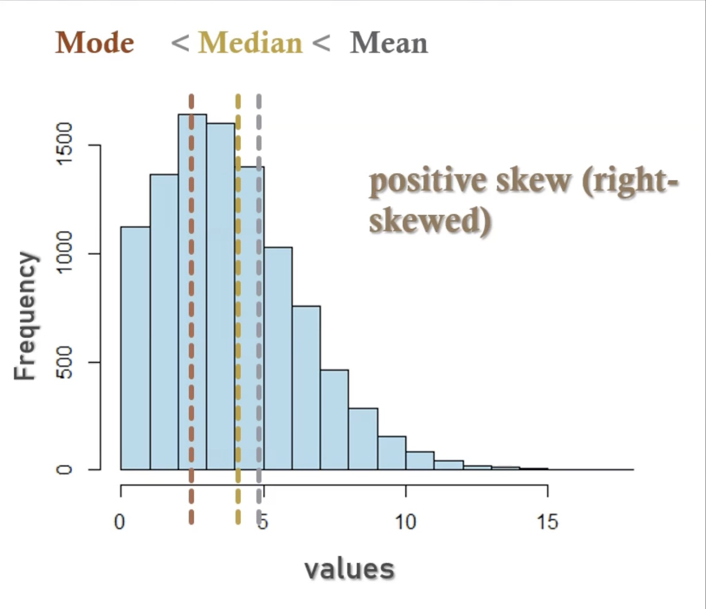
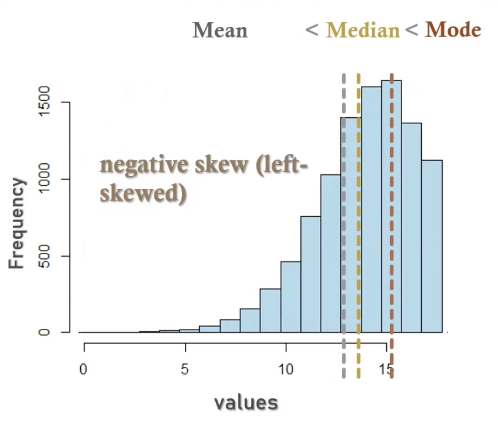
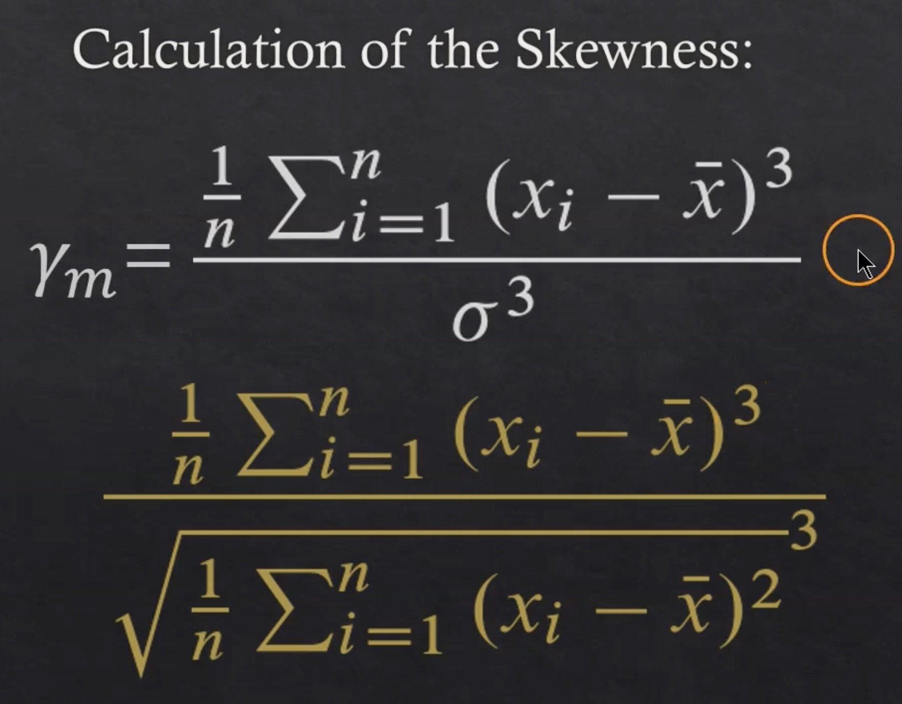
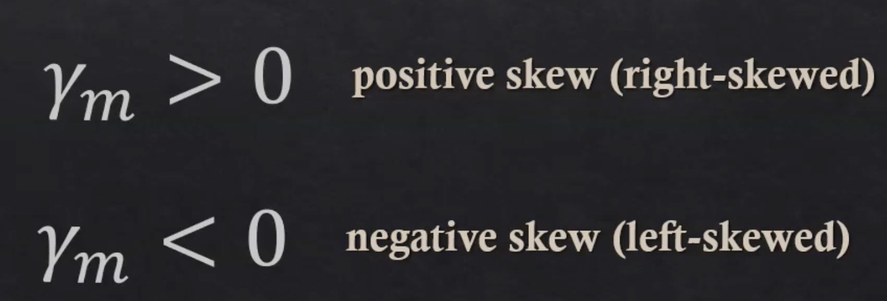
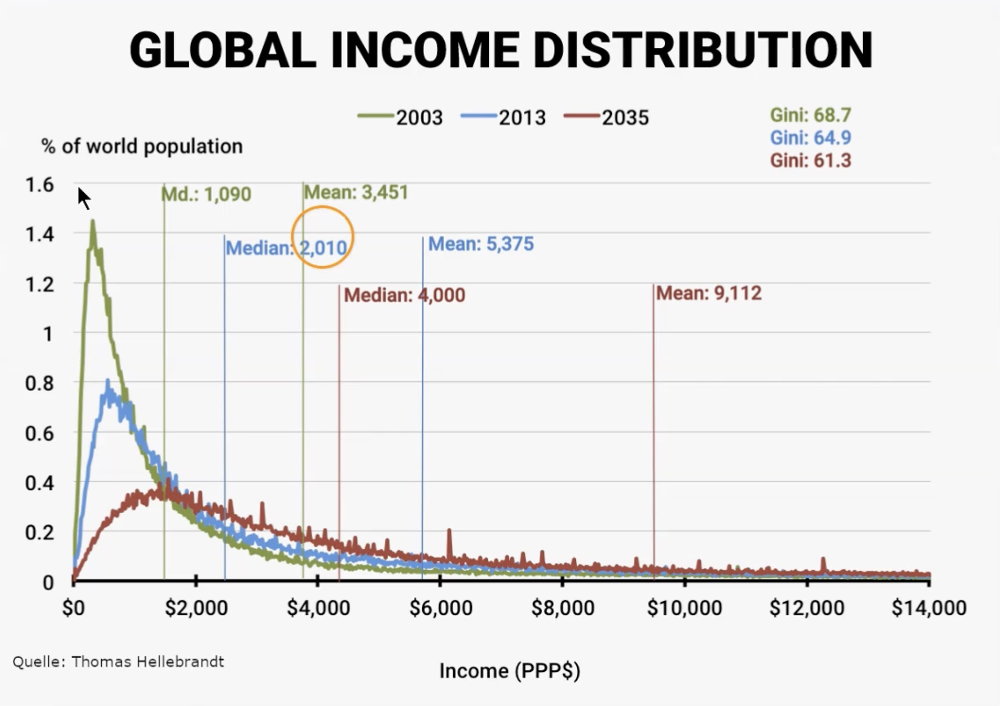
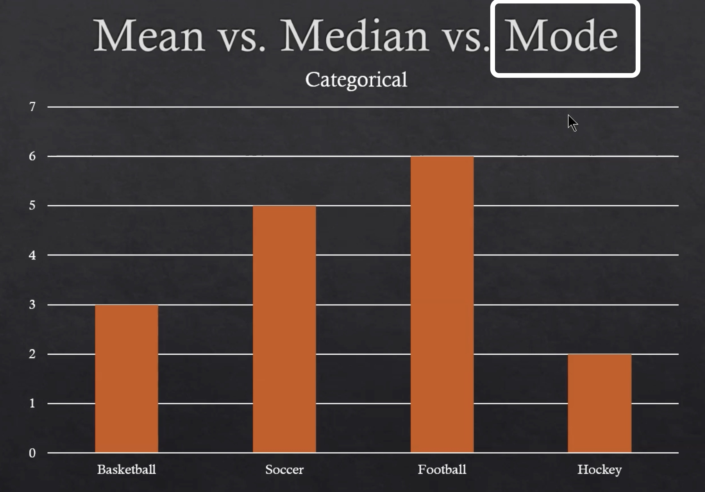

# Statistics

---

## Table of Contents

- [Statistics](#statistics)
  - [Table of Contents](#table-of-contents)
  - [Skewness](#skewness)
    - [Positive Skew (Right‑Skewed)](#positive-skew-rightskewed)
    - [Negative Skew (Left‑Skewed)](#negative-skew-leftskewed)
    - [Why skewness matters](#why-skewness-matters)
    - [Formula](#formula)
  - [Mean](#mean)
    - [What the mean tells you](#what-the-mean-tells-you)
    - [When NOT to use the mean](#when-not-to-use-the-mean)
  - [Median](#median)
    - [Why median matters](#why-median-matters)
  - [Mode](#mode)
    - [When mode is useful](#when-mode-is-useful)
  - [Mean Or Median Or Mode](#mean-or-median-or-mode)
  - [Range](#range)
    - [When to use it](#when-to-use-it)
    - [Limitation](#limitation)
  - [Interquartile Range (IQR)](#interquartile-range-iqr)
    - [Definition](#definition)
    - [Example](#example)
    - [Why IQR matters](#why-iqr-matters)
  - [Population and Sample](#population-and-sample)
    - [Population](#population)
    - [Sample](#sample)
  - [Variance](#variance)
    - [Formal Definition](#formal-definition)
    - [Intuition](#intuition)
    - [Why Variance Matters](#why-variance-matters)
    - [Population Variance](#population-variance)
      - [Definition](#definition-1)
        - [Key idea](#key-idea)
        - [When to use](#when-to-use)
    - [Sample Variance](#sample-variance)
      - [Definition](#definition-2)
        - [Why divide by n − 1?](#why-divide-by-n--1)
        - [When to use](#when-to-use-1)
        - [Intuition](#intuition-1)
    - [How the definitions change](#how-the-definitions-change)
  - [Standard Deviation](#standard-deviation)
    - [Formal Definition](#formal-definition-1)
    - [Intuition](#intuition-2)
    - [Why Standard Deviation Matters](#why-standard-deviation-matters)
  - [Scaling and Shifting](#scaling-and-shifting)
    - [Scaling](#scaling)
    - [Shifting](#shifting)
    - [Impact of Scaling (multiplying)](#impact-of-scaling-multiplying)
    - [Impact of Shifting (adding/subtracting)](#impact-of-shifting-addingsubtracting)

---

## Skewness

- Skewness is a measure of asymmetry in a dataset.

- It tells you whether the data leans more to the left or the right instead of being perfectly balanced around the mean.

- Skewness describes how “off‑center” a distribution is.

- Skewness = 0 → perfectly symmetric (like a normal bell curve)

*- Positive skew (right‑skewed) → long tail on the right

 Negative skew (left‑skewed) → long tail on the left

### Positive Skew (Right‑Skewed)

- Outliers are on the right side

- Tail extends to the right

- Mean > Median

- Example: income distribution (few very high incomes pull the mean right)

### Negative Skew (Left‑Skewed)

- Outliers are on the left side

- Tail extends to the left

- Mean < Median

- Example: test scores where most students score high but a few score very low

### Why skewness matters

- It tells you whether the mean is a reliable measure of central tendency

- Helps decide whether to use mean or median

- Important in machine learning, finance, and data science because skewed data affects models

### Formula

$\text{Skewness} = \frac{1}{n} \sum_{i=1}^{n} \left( \frac{x_i - \bar{x}}{s} \right)^3$

Where:

- $n$ = number of observations  
- $x_i$ = each individual value  
- $\bar{x}$ = mean of the dataset  
- $s$ = standard deviation

---

## Mean

The **mean** in statistics is the average of a set of numbers — the single value that best represents the entire dataset.

### What the mean tells you

- The central tendency of the data

- A general “middle” value

- Useful when data is evenly distributed

### When NOT to use the mean

- If your data has outliers (very large or very small values), the mean can be misleading — in those cases, the median is often better.

---

## Median

- The median in statistics is the value that sits exactly in the middle of a sorted dataset.

- It’s a measure of central tendency that tells you the “middle point” of your data.

### Why median matters

- It is not affected by outliers (extremely large or small values).

- It often gives a better “typical value” than the mean when data is skewed.

---

## Mode

- The mode in statistics is the value that appears most frequently in a dataset.

- It’s another measure of central tendency, but unlike the mean or median, it focuses on frequency, not position or average.

### When mode is useful

- When analyzing categorical data (e.g., most common product, most frequent complaint type)

- When the dataset has repeated values

- When mean/median don’t make sense (e.g., favorite color)

---

## Mean Or Median Or Mode

- Mean sensitive towords outliers (asymmetrical datasets)

- Median less sensitive towards outliers
  - Alternative / Complementary

- Mode for categorical values

---

## Range

- Range measures how spread out your data is from the smallest value to the largest value.

### When to use it

- Quick sense of spread

- Easy to compute

### Limitation

- Very sensitive to outliers  
(One extreme value can distort the range.)

---

## Interquartile Range (IQR)

- IQR measures the spread of the middle 50% of your data.

- It is much more robust than the range because it ignores extreme values.

### Definition

$IQR = 𝑄3 − 𝑄1$

- Where
  - $Q1$ (25th percentile) = value at the first quartile

  - $Q3$ (75th percentile) = value at the third quartile

### Example

Sorted data: $4, 7, 10, 12, 20$

$Q1 = 7$

$Q3 = 12$

$IQR = 12 − 7 = 5$

### Why IQR matters

- Resistant to outliers

- Used in box plots

- Used to detect outliers (Tukey’s rule)

- Common in ML preprocessing and EDA

---

## Population and Sample

### Population

- A population is the entire group you are interested in studying.

- Examples:
  - All customers of Amazon
  
  - Every student in a school
  
  - All manufactured chips in a factory
  
  - Every possible data point in a dataset

- A population contains every member, so it represents the full truth — but it’s often too large, expensive, or impossible to measure directly.

### Sample

- A sample is a subset of the population that you actually collect data from.

- Examples:
  - 1,000 Amazon customers surveyed

  - 200 students selected for a study

  - 50 chips tested for defects

  - A batch of observations taken from a large dataset

- A sample is used because studying the entire population is usually impractical.

- We use the sample to estimate what is true about the population.

---

## Variance

- Variance measures how spread out your data is.

- It tells you how far the numbers are from the mean, on average.

- If the data points are close to the mean → low variance  

- If the data points are far from the mean → high variance

### Formal Definition

$Variance = \frac {\sum_{i=1}^{N}(x_i−mean)^2}{𝑁}$

### Intuition

- Think of variance as:

    “How much do the numbers wiggle away from the center?”

- If all values are similar → variance is small

- If values jump around a lot → variance is large

### Why Variance Matters

- Used in machine learning to understand data spread

- Part of standard deviation

- Helps detect outliers

- Used in loss functions (like MSE)

- Important in probability distributions

### Population Variance

- Population variance assumes you have every data point in the entire group you care about.

#### Definition

$\sigma^2 = \frac {\sum_{i=1}^{N}(x_i−\mu)^2}{𝑁}$

##### Key idea

- You divide by N (the total number of values).

- No correction is needed because you already have the full truth.

##### When to use

- You have all customers

- You have all students

- You have all manufactured items

- You have all data points in your dataset

### Sample Variance

- Sample variance assumes your data is only a subset of a larger population.

#### Definition

$s^2 = \frac {\sum_{i=1}^{n}(x_i−\bar{x})^2}{n-1}$

##### Why divide by n − 1?

- Because a sample underestimates the true variance of the population.

- Dividing by $n − 1$ corrects this bias — this is called **Bessel’s correction**.

##### When to use

- You collected a survey

- You sampled 100 items from a factory

- You took a subset of a dataset

- You’re estimating population variance from limited data

##### Intuition

- Imagine you’re trying to guess how spread out all students’ test scores are, but you only have 20 students’ scores.

- Those 20 scores will look more similar to each other than the entire school’s scores.

- So sample variance bumps the value slightly upward by dividing by $n − 1$.

### How the definitions change

| Concept | Population Variance | Sample Variance |
| ----------- | ----------- | ----------- |
| Formula | Divide by N | Divide by n − 1 |
| Mean used | Population mean $\mu$ | Sample mean $\bar{x}$ |
| Purpose | True spread | Estimated spread |
| Bias | Unbiased (full data) | Corrected for bias |
| NumPy | $np.var(data)$ | $np.var(data, ddof=1)$ |

> **Note:-**  
>
> - $N$ represents population, and $n$ represents sample.
>
> - $\mu$ represents population means and $\bar{x}$ represents sample mean.

---

## Standard Deviation

- Standard deviation measures how spread out your data is, just like variance — but in the same units as your data, which makes it much easier to interpret.

- If variance tells you how much the data wiggles, standard deviation tells you how big that wiggle feels.

### Formal Definition

- Standard deviation is simply the square root of variance.

  $Standard Deviation = \sqrt{\sigma^2}$

  $Standard Deviation = \sqrt{s^2}$

### Intuition

- Low standard deviation → data points are close to the mean.

- High standard deviation → data points are far from the mean.

- It’s a measure of consistency.

### Why Standard Deviation Matters

- Used everywhere in machine learning

- Helps detect outliers

- Used in normal distribution (bell curve)

- Used in loss functions

- Helps understand data spread in EDA

- More interpretable than variance because it’s in the same units as your data

---

## Scaling and Shifting

### Scaling

- Multiply every value by a constant

### Shifting

- Add or subtract a constant

### Impact of Scaling (multiplying)

- What scaling changes
  - Mean → multiplied by $c$
  - Variance → multiplied by $c^2$
  - Standard deviation → multiplied by $c$
  - Range → multiplied by $c$
  - IQR → multiplied by $c$

- What scaling doesn't change
  - Shape of distribution
  - Skewness
  - Kurtosis
  - Correlation
  - Relative ordering

- Scaling stretches or shrinks the data like zooming in or out — but the pattern stays identical.

### Impact of Shifting (adding/subtracting)

- Shifting moves your data left or right.

- What shifting changes
  - Mean → increases by $k$
  - Mean → increases by $k$
  - Mode → increases by $k$

- What shifting doesn't change
  - Variance
  - Standard deviation
  - Range
  - IQR
  - Skewness
  - Kurtosis
  - Shape

- Shifting slides the entire distribution without stretching it.
